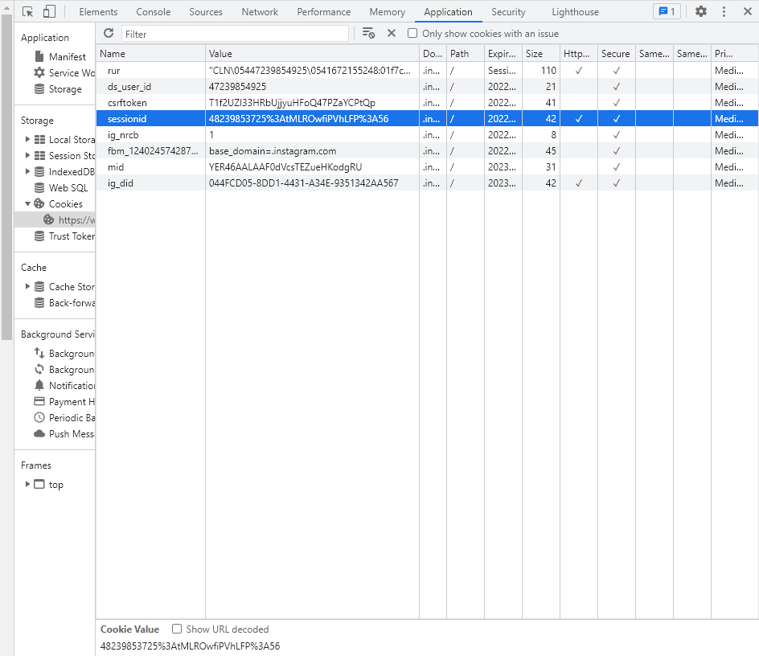
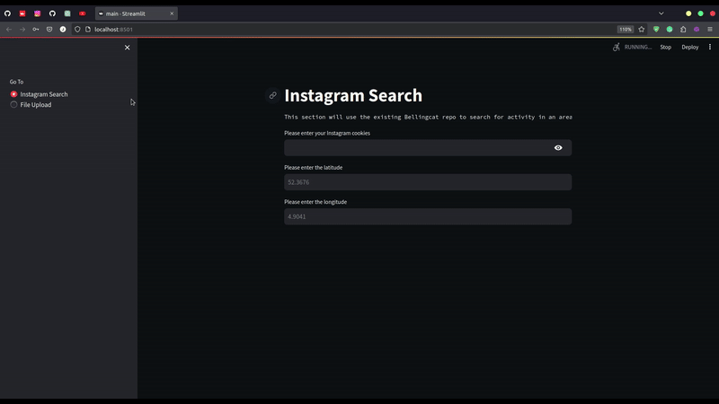
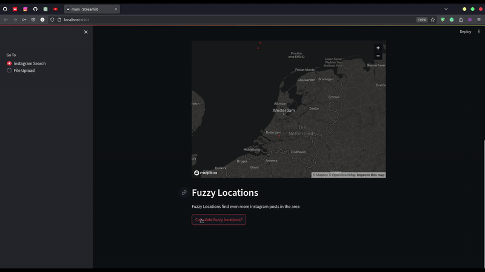

# Instagram Location Dashboard
An online dashboard to search for Instagram posts in a certain location and plot those on a map. 
- Also allows the user to upload their own geolocation CSV file to plot. 
- This is an expansion of the ´instagram-location-search´ repo found [here](https://github.com/bellingcat/instagram-location-search)


## Instagram Search
This section 


**This requires your Instagram cookies**

How to find them?
1. Sign into Instagram
2. Open the Developer console  (´Ctrl+Shift+I´ in some browsers)
3. Chrome
   1. Navigate to **Application** tab
4. Firefox
   1. Navigate to **Storage** tab
5. Copy and paste the "Value" column for each cookie from the image into the **Cookie format**



**Cookie format**:

```python
'cookie="mid=; ig_did=; csrftoken=; ds_user_id=; sessionid=; shbid=; shbts=; datr=; rur="'
```

### Instructions



### Fuzzy Locations


## Upload File
1. Click upload file
2. Choose CSV file with GPS coordinates columns

## How to contribute to this

Assumes you have Python3.11 and its ´virtualenv´ pip library
1. Clone the repo
2. Run `python3.11 -m venv env`
3. Run `source env/bin/activate`
4. Run `streamlit run app/main.py`

### Testing
- Create a file called `.env` in the root directory and create a variable called `INSTAGRAM_COOKIES`


## Versioning
### Tags

## Structure
Using this file structure for Streamlit: https://github.com/ash2shukla/streamlit-heroku/blob/master/app/main.py